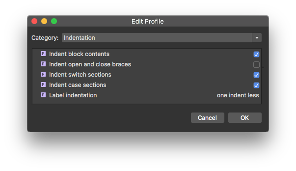
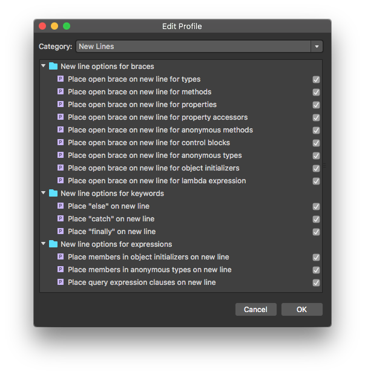
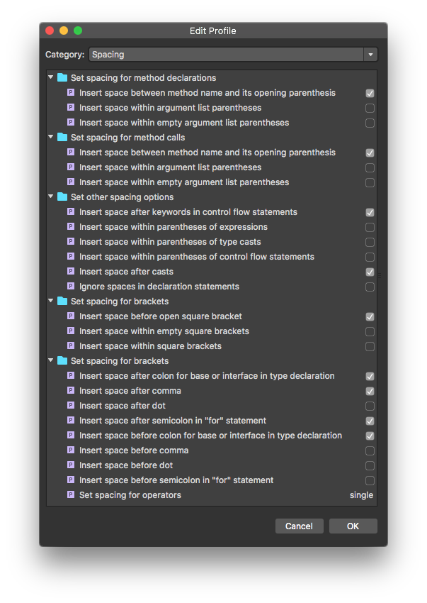
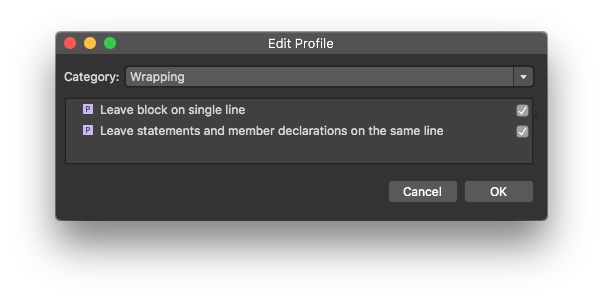

# Producer

iOS:     
Android: 
   

# Project Guidelines

From a high level, we'll follow [GitHub Flow][0] - a lightweight, branch-based workflow.

## Contributing

- **Every contribution to the codebase/docs/creative should in a separate branch associated with an Issue**
- **Before creating a branch, assign yourself the Issue and move the Issue's Project item to `In Progress`**
- **Branches should be branched from `master` and be named something that clearly corresponds to the Issue**
- **When a branch is complete, move the Issue's Project item to `Needs Review` and submit a Pull Request**
- **DO NOT MERGE YOUR OWN PULL REQUESTS - they must be reviewed/approved before merging into `master`**

## 🔨 Build & 🎨 Paint

All UI contributions (new screens, etc.) will be created in two separate steps; **_Build_** and **_Paint_** _(described in more detail below)_

### 1. 🔨 - Build
In the **_Build_** phase of a new screen or other UI element, you're just getting the required data on the screen and implementing that screen/UI element's functionality - **without making it "pretty"** _(formatting, colors, fonts, animations, etc.)_.  This allows us to **a)** make updates/tweaks/changes to the data/functionality before those changes could effect the layout, animations, etc., and **b)** benchmark the performance of data/functionality to ensure we don't degrade the performance during the **_Paint_** phase.

### 2. 🎨 - Paint
Formatting, colors, fonts, animations, etc. are added during the **_Paint_** phase of the screen/element. This will be a **separate branch and pull request than the screen/element's _Build_ phase branch.**

## 📘 Documentation

This project **must** be well documented. We'll have docs outlining the data, architecture, flow, etc.

### Guidelines

- Everything must be documented clearly and concisely - these documents will be public
- All documentation will be in markdown, and during development, saved in the repo's `docs` directory
- Upon project completion, they'll be moved to the repo's wiki

# Project Setup

Steps to get the app running locally are explained below.  These steps only apply while the project is in development and will be much simpler by the time we complete the project.

## Visual Studio Mac

If you're going to run the `Producer.Functions` project locally on a mac, you'll have to have the addin installed.  Currently, this only works in the **alpha channel**.  Once on the alpha channel, you can find/install the **Azure Functions development** addin by going to _Visual Studio >> Extensions... >> Gallery >> IDE Extensions_.

## Keys & Connection Strings

This is a public repo, so we need to **make sure we don't commit any private keys** and refresh any keys that we accidentally commit.

### iOS

All the keys, urls, etc. needed to run the app are in the app's settings _(in Settings.app under Producer)_.  This is a sample app, so this will be the way we handle all keys, urls, connection strings, etc. -- **Do not hard-code keys in the app**.    Ping me (Colby) and I'll get you what you need.

### Android

Android isn't finished yet, but it'll be handled in the same way as iOS.  Most of the settings code is shared.

## Functions

All keys, connection strings, etc. are in `local.settings.json`.  This file is ignored by git - please make sure it doesn't get committed.  Ping me (Colby) for the values needed in your local copy.

## Azure

This app utilizes the following Azure services:

- Azure App Service
- Azure Functions
- Azure Storage
- Azure Cosmos DB, DocumentDB
- Azure Notification Hubs
- Azure Media Service
- Azure CDN
- Application Insights

Ping me (Colby) for access to the resources group.

## Mobile Center

This app uses Mobile Center, ping me (Colby) for the app keys.

# Code 

## C# Code

### General

- Don't use `this` unless absolutely necessary
- Don't use `private` it is implied

### Structure

- Fields
- Properties
- Constructors
- Methods

### Comments

- Comment your damn code
- Don't check-in commented out code (including `TODO:`)

### Naming

- Names should be descriptive
- Public members start with uppercase
- Private members start with lowercase letters
- Don't prepend underscores unless it's a backing field
- Don't append `Async` to method names unless there's a non-async version

## Visual Studio C# Formatting Settings

[0]:https://guides.github.com/introduction/flow/
